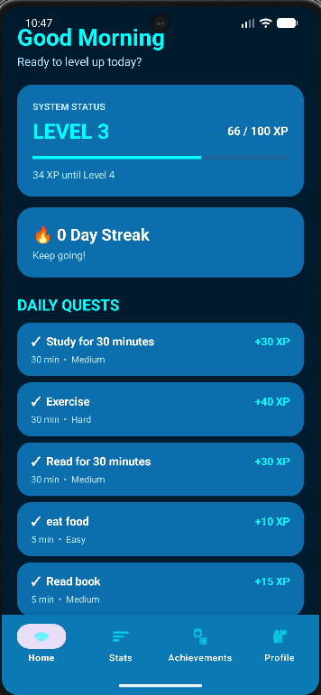
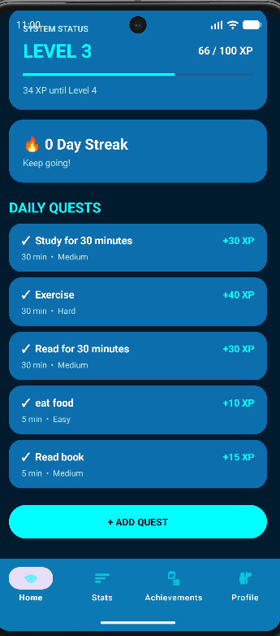
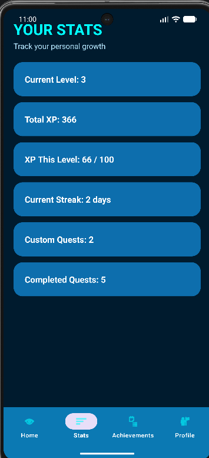
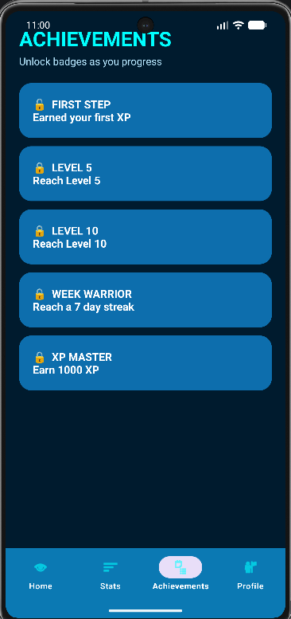
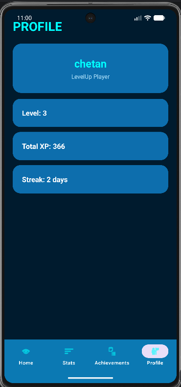

# LevelUp

LevelUp is an Android productivity and habit-tracking application that turns daily activities into quests. Users can complete quests, earn XP, level up, maintain streaks, and unlock achievements.

## Features

- Daily productivity quests
- Create custom quests
- Quest timer
- XP reward system
- Level progression
- Daily streak tracking
- XP decay system
- Achievement system
- Statistics dashboard
- User profile
- Local data storage

## Screens

The application contains four main sections:

- **Home** – View and complete quests and create custom quests.
- **Stats** – View productivity and progression statistics.
- **Achievements** – View unlocked and locked achievements.
- **Profile** – View the user's level, XP, and streak.

## Technology Stack

- **Language:** Kotlin
- **Platform:** Android
- **UI:** XML
- **Architecture:** Activity + Fragments
- **Local Storage:** SharedPreferences
- **Data Format:** JSON
- **Build System:** Gradle Kotlin DSL
- **Minimum SDK:** 24
- **Target SDK:** 37
- **Compile SDK:** 37
- **Java:** 11

## 📸 Output Screenshots

### 🏠 Home Screen

---

### ➕ Create Custom Quest / Home Screen

---

### 📊 Stats Screen

---

### 🏆 Achievements Screen

---

### 👤 Profile Screen

---

## Project Structure

LevelUp/
│
├── app/
│   └── src/
│       ├── androidTest/
│       │
│       ├── main/
│       │   ├── java/com/example/levelup/
│       │   │   ├── MainActivity.kt
│       │   │   ├── LevelUpData.kt
│       │   │   ├── HomeFragment.kt
│       │   │   ├── StatsFragment.kt
│       │   │   ├── AchievementsFragment.kt
│       │   │   └── ProfileFragment.kt
│       │   │
│       │   ├── res/
│       │   │   ├── drawable/
│       │   │   ├── layout/
│       │   │   ├── menu/
│       │   │   ├── mipmap/
│       │   │   ├── values/
│       │   │   └── values-night/
│       │   │
│       │   └── AndroidManifest.xml
│       │
│       └── test/
│
├── gradle/
├── build.gradle.kts
├── settings.gradle.kts
├── gradle.properties
│
├── achievements.png
├── home.png
├── home2.png
├── profile.png
├── stats.png
│
└── README.md
